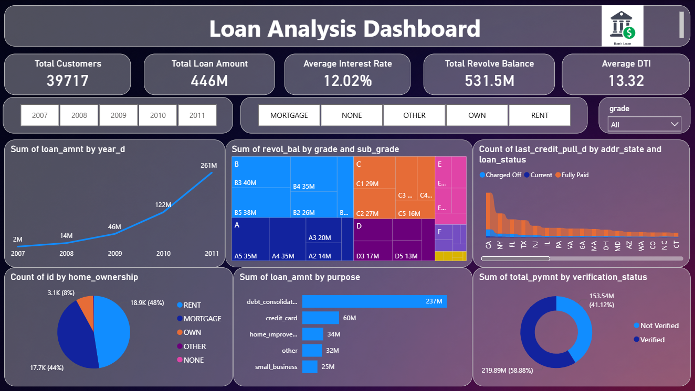

# Bank Loan Analysis & Risk Dashboard
Data analysis and interactive dashboard project exploring bank loan performance, borrower characteristics and risk-related trends using SQL, Excel, Tableau and Power BI.

## 📌 Project Overview

This project focuses on analyzing bank loan data to identify trends and patterns across loan amounts, loan grades, sub-grades, verification status, loan status, borrower characteristics and geographic distribution.

The analysis combines data preparation, SQL-based analysis and interactive dashboard development to transform raw loan data into meaningful business insights.

## 🎯 Business Objective

The objective of this project is to analyze the bank loan portfolio, understand loan and borrower characteristics, identify important trends and patterns, and present the findings through interactive dashboards.

The analysis focuses on understanding:

- Loan amount trends
- Loan grade and sub-grade performance
- Revolving balance patterns
- Verification status
- Loan status distribution
- Geographic loan patterns
- Home ownership characteristics
- Credit-related trends

## 📊 Dataset

The dataset contains information related to bank loans, borrowers, loan characteristics, payment-related attributes and credit information.

Key fields used in the analysis include:

- Loan amount
- Funded amount
- Loan grade
- Loan sub-grade
- Verification status
- Loan status
- Revolving balance
- Home ownership
- State
- Credit-related dates
- Payment-related information

## 🛠️ Tools & Technologies

| Tool | Purpose |
|---|---|
| SQL / MySQL | Data querying and analysis |
| Microsoft Excel | Data preparation and analysis |
| Tableau | Interactive data visualization |
| Power BI | Dashboard development |

## 📊 Dashboard Preview

## 🔍 Business Questions

The analysis was designed to answer the following questions:

1. How do loan amounts vary across different years?

2. How does revolving balance vary across loan grades and sub-grades?

3. How do payment-related measures vary across verification statuses?

4. How is loan status distributed across different states?

5. What patterns can be observed between home ownership and loan characteristics?

6. How do credit-related dates such as `last_credit_pull_d` vary across loan records?

7. What trends and patterns can be identified from the overall loan portfolio?

## 🧹 Data Preparation

The dataset was reviewed and prepared before analysis and visualization.

Key preparation activities included:

- Reviewing the dataset structure and column information
- Checking data types and field consistency
- Identifying relevant fields for analysis
- Preparing date-related fields for analysis
- Reviewing missing and inconsistent values
- Preparing the data for SQL analysis and dashboard visualization

## 📈 Analysis Performed

### 1. Loan Amount by Year

Analyzed loan amounts across different years to identify changes and trends in lending activity over time.

### 2. Revolving Balance by Grade and Sub-Grade

Compared revolving balances across loan grades and sub-grades to identify differences between borrower segments.

### 3. Payment Analysis by Verification Status

Analyzed payment-related measures across different verification categories to identify variations in payment behavior.

### 4. Loan Status by State

Examined the distribution of loan statuses across states to identify geographic patterns in loan performance.

### 5. Home Ownership Analysis

Analyzed loan and borrower characteristics across different home ownership categories.

### 6. Credit Pull Date Analysis

Used `last_credit_pull_d` to examine credit-related trends and their relationship with loan records.

